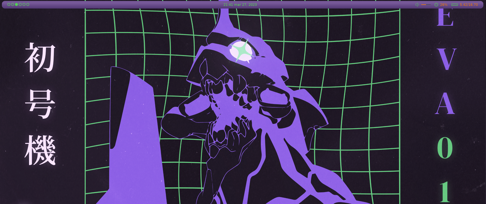
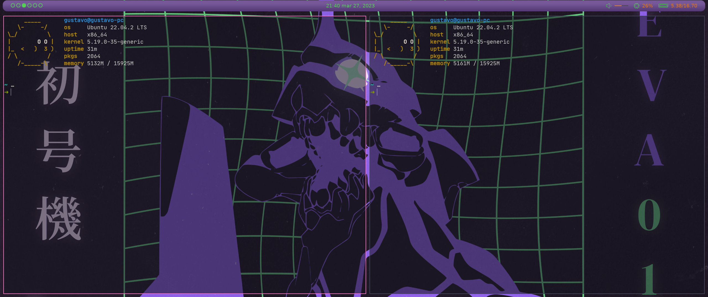

<h1 align="center"> <a href="https://github.com/elkowar/eww"> EWW - Evangelion Theme <h1> </a>

## How to install

### Requiriments
- eww(https://github.com/elkowar/eww)

### Install
- Clone that repository at path ~/.config/eww
- Set padding on your primary monitor with bspc: bspc config -m DP-1 top_padding 49
- Run: eww open bar

Alternatively, use this script:

- Set the name of your primary monitor
- chmod +x ./run_topbar.sh
- ./run_topbar.sh

